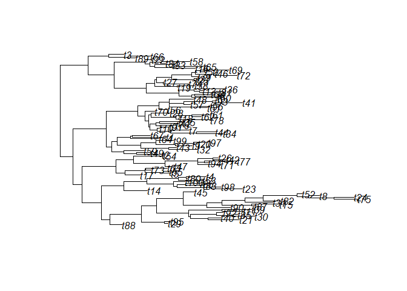

<!-- README.md is generated from README.Rmd. Please edit that file -->

# phyf

<!-- badges: start -->

[](https://github.com/rdinnager/phyf/actions/workflows/R-CMD-check.yaml)
<!-- badges: end -->

The goal of phyf is to implement a `tibble` subclass useful for
statistical modelling on phylogenetic trees. It mainly implements an
phylogenetic flow (`pf`) object that is essentially a tibble with one or
more phylogenetic flow collection (`pfc`) columns. Phylogenetic flow
collection columns are collections of phylogenetic flow paths (`pfp`),
which store data on how information flows through a phylogeny from its
root node (phylogenies must be rooted to work with `phyf`) to its tips
(and its internal nodes). This allows for easy manipulation of the
phylogeny and associated data. The objects are used in the package
`fibre` for phylogenetic branch regression models, a highly felxible
framework for comparative analysis and modelling trait evolution across
a phylogeny.

## Installation

You can install the development version of phyf from
[GitHub](https://github.com/) with:

``` r
# install.packages("devtools")
devtools::install_github("rdinnager/phyf")
```

## Example

``` r
library(phyf)
#> 
#> Attaching package: 'phyf'
#> The following object is masked from 'package:stats':
#> 
#>     pf
library(ape)
```

Create a random phylogeny for testing:

``` r
test_tree <- rtree(100) 
plot(test_tree)
```



Turn it into a `tibble`-based phylogenetic flow format (`pf`) using
`as_pf()`:

``` r
tree_pf <- as_pf(test_tree)
tree_pf
#> # A tibble: 198 × 2
#>    node_name phyf                                                               
#>    <chr>     <pf<:198>>                                                         
#>  1 t61       root---0.2--->Node2---0.9--->Node…Node4---0.4--->Node5---0.9--->t61
#>  2 t76       root---0.2--->Node2---0.9--->Node…Node4---0.4--->Node5---0.7--->t76
#>  3 t71       root---0.2--->Node2---0.9--->Node…Node4---0.9--->Node6---0.3--->t71
#>  4 t75       root---0.2--->Node2---0.9--->Node…Node6---0.4--->Node7---0.2--->t75
#>  5 t53       root---0.2--->Node2---0.9--->Node…Node6---0.4--->Node7---0.2--->t53
#>  6 t49       root---0.2--->Node2---0.9--->Node…Node8---0.8--->Node9---0.5--->t49
#>  7 t91       root---0.2--->Node2---0.9--->Node…Node8---0.8--->Node9---0.8--->t91
#>  8 t34       root---0.2--->Node2---0.9--->Node3---0.8--->Node8---0.6--->t34     
#>  9 t45       root---0.23-->Node2---0.13-->Node…de11---0.38-->Node12---0.69-->t45
#> 10 t81       root---0.23-->Node2---0.13-->Node…de11---0.38-->Node12---0.11-->t81
#> # … with 188 more rows
```

This `tibble` is easy to join data by using the `node_name`, which
include the tip labels from the phylogeny as well as ‘NodeXX’ for
internal nodes, where XX starts a 1 and goes to the total number of
internal nodes. You can also use `node_nums` to join by the node number,
where the node number uses the traditional ordering of the nodes used in
the `ape` package in `phylo` objects. Usually you will only have data on
the tips, and so when joining to the `pf` object (using
e.g. `dplyr::left_join()`) the internal node rows will recieve `NA`
values. This is the desired behaviour. The missing values are easy to
drop for fitting a model, but are useful later when making prediction
(that is, ancestral state estimates).
