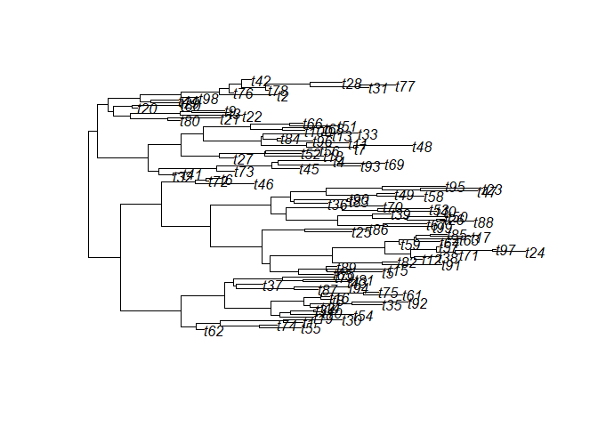

<!-- README.md is generated from README.Rmd. Please edit that file -->

# phyf <a href="https://rdinnager.github.io/phyf/"></a>

<!-- badges: start -->

[](https://github.com/rdinnager/phyf/actions/workflows/R-CMD-check.yaml)
<!-- badges: end -->

The goal of phyf is to implement a `tibble` subclass useful for
statistical modelling on phylogenetic trees. It mainly implements an
phylogenetic flow (`pf`) object that is essentially a tibble with one or
more phylogenetic flow collection (`pfc`) columns. Phylogenetic flow
collection columns are collections of phylogenetic flow paths (`pfp`)
and phylogenetic flow features (`pff`), which store data on how
information flows through a phylogeny from its root node (phylogenies
must be rooted to work with `phyf`) to its tips (and its internal
nodes). This allows for easy manipulation of the phylogeny and
associated data. The objects are used in the package `fibre` for
phylogenetic branch regression models, a highly felxible framework for
comparative analysis and modelling trait evolution across a phylogeny.

## Installation

You can install the development version of phyf from
[GitHub](https://github.com/) with:

``` r
# install.packages("devtools")
devtools::install_github("rdinnager/phyf")
```

## Example

``` r
library(phyf)
#> 
#> Attaching package: 'phyf'
#> The following object is masked from 'package:stats':
#> 
#>     pf
library(ape)
```

Create a random phylogeny for testing:

``` r
test_tree <- rtree(100) 
plot(test_tree)
```



Turn it into a `tibble`-based phylogenetic flow format (`pf`) using
`pf_as_pf()`:

``` r
tree_pf <- pf_as_pf(test_tree)
tree_pf
#> # A tibble: 198 × 3
#>    label is_tip phlo                                                            
#>    <chr> <lgl>  <pfc>                                                           
#>  1 t88   TRUE   --0.373-->Node2--0.271-->Node3-…ode4--0.241-->Node5--0.368-->t88
#>  2 t29   TRUE   --0.373-->Node2--0.271-->Node3-…ode6--0.678-->Node7--0.104-->t29
#>  3 t95   TRUE   --0.373-->Node2--0.271-->Node3-…ode6--0.678-->Node7--0.176-->t95
#>  4 t21   TRUE   --0.373-->Node2--0.271-->Node3-…e10--0.513-->Node11--0.920-->t21
#>  5 t40   TRUE   --0.373-->Node2--0.271-->Node3-…e10--0.513-->Node11--0.372-->t40
#>  6 t30   TRUE   --0.373-->Node2--0.271-->Node3-…e12--0.493-->Node13--0.622-->t30
#>  7 t85   TRUE   --0.373-->Node2--0.271-->Node3-…e12--0.493-->Node13--0.123-->t85
#>  8 t92   TRUE   --0.373-->Node2--0.271-->Node3-…e10--0.761-->Node12--0.193-->t92
#>  9 t11   TRUE   --0.373-->Node2--0.271-->Node3-…de9--0.979-->Node14--0.611-->t11
#> 10 t39   TRUE   --0.373-->Node2--0.271-->Node3-…de9--0.979-->Node14--0.871-->t39
#> # … with 188 more rows
```

This `tibble` is easy to join data by using the `label`, which include
the tip labels from the phylogeny as well as ‘NodeXX’ for internal
nodes, where XX starts a 1 and goes to the total number of internal
nodes (the names are generated using `ape::makeNodeLabel()`). You can
also use the `node_num` column (not yet implemented) to join by the node
number, where the node number is based on the node at the end of each
phylogeny edge, and uses the traditional ordering of the nodes from the
`ape` package in `phylo` objects. Usually you will only have data on the
tips, and so when joining to the `pf` object (using
e.g. `dplyr::left_join()`) the internal node rows will recieve `NA`
values. This is the desired behaviour. The missing values are easy to
drop for fitting a model, but are useful later when making predictions
(that is, ancestral state estimates).

## Built-in Datasets

`{phyf}` includes a number of built-in datasets to demonstrate the
format. For example the [AVONET
dataset](https://figshare.com/articles/dataset/AVONET_morphological_ecological_and_geographical_data_for_all_birds_Tobias_et_al_2021_Ecology_Letters_/16586228),
can be accessed as `avonet`:

``` r
avonet
#> # A tibble: 13,338 × 39
#>    label      is_tip phlo            Speci…¹ Family3 Order3 Total…² Female  Male
#>    <chr>      <lgl>  <pfc>           <chr>   <chr>   <chr>    <dbl>  <dbl> <dbl>
#>  1 Struthio_… TRUE   ---26.8…camelus Struth… Struth… Strut…       8      1     4
#>  2 Rhea_amer… TRUE   --26.84…ericana Rhea a… Rheidae Rheif…       5      2     2
#>  3 Rhea_penn… TRUE   --26.84…pennata Rhea p… Rheidae Rheif…       6      3     2
#>  4 Apteryx_a… TRUE   --26.84…stralis Aptery… Aptery… Apter…       6      2     2
#>  5 Apteryx_m… TRUE   --26.84…antelli Aptery… Aptery… Apter…       4      2     2
#>  6 Apteryx_o… TRUE   --26.84…_owenii Aptery… Aptery… Apter…       5      2     3
#>  7 Apteryx_h… TRUE   --26.84…haastii Aptery… Aptery… Apter…       9      6     3
#>  8 Dromaius_… TRUE   --26.84…landiae Dromai… Dromai… Casua…       5      2     3
#>  9 Casuarius… TRUE   --26.84…suarius Casuar… Casuar… Casua…       7      2     3
#> 10 Casuarius… TRUE   --26.84…ennetti Casuar… Casuar… Casua…       4      1     0
#> # … with 13,328 more rows, 30 more variables: Unknown <dbl>,
#> #   Complete.measures <dbl>, Beak.Length_Culmen <dbl>, Beak.Length_Nares <dbl>,
#> #   Beak.Width <dbl>, Beak.Depth <dbl>, Tarsus.Length <dbl>, Wing.Length <dbl>,
#> #   Kipps.Distance <dbl>, Secondary1 <dbl>, `Hand-Wing.Index` <dbl>,
#> #   Tail.Length <dbl>, Mass <dbl>, Mass.Source <chr>, Mass.Refs.Other <chr>,
#> #   Inference <chr>, Traits.inferred <chr>, Reference.species <chr>,
#> #   Habitat <chr>, Habitat.Density <dbl>, Migration <dbl>, …
```
